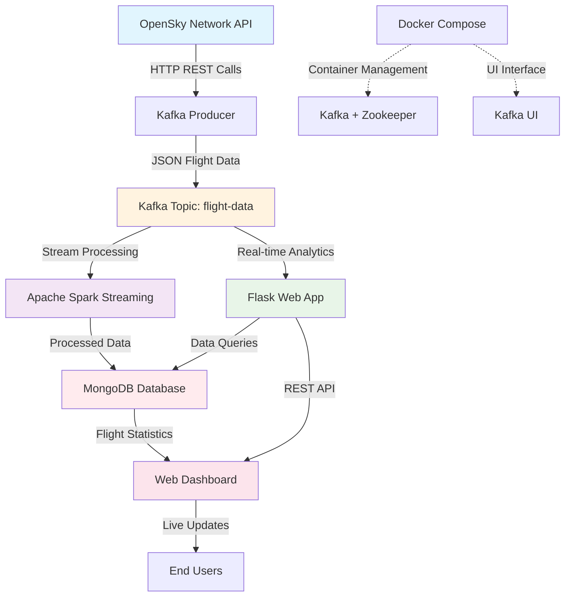

# ✈️ Gerçek Zamanlı Uçak Takip Sistemi

Bu proje, OpenSky Network API'sini kullanarak gerçek zamanlı uçak verilerini toplar, işler ve görselleştirir. Sistem, modern veri mühendisliği araçlarını kullanarak büyük veri işleme ve gerçek zamanlı analiz yapar.

## 🏗️ Sistem Mimarisi



### Bileşenler

1. **Kafka Producer** (`kafka_producer.py`): OpenSky API'den uçak verilerini alır ve Kafka'ya gönderir
2. **Spark Consumer** (`spark_consumer.py`): Kafka'dan veri akışını alır ve MongoDB'ye kaydeder
3. **Flask Dashboard** (`app.py`): Web tabanlı görselleştirme ve analiz arayüzü
4. **Docker Compose**: Kafka, Zookeeper ve Kafka UI servisleri
5. **Ana Kontrol** (`main.py`): Tüm servisleri yönetir

## 📋 Gereksinimler

### Yazılım Gereksinimleri
- Python 3.8+
- Docker ve Docker Compose
- MongoDB
- Java 8+ (Spark için)

### Python Paketleri
```bash
pip install kafka-python
pip install pyspark
pip install flask
pip install pymongo
pip install requests
```

## 🚀 Kurulum

### 1. Projeyi İndirin
```bash
git clone <repository-url>
cd flight-tracking-system
```

### 2. Proje Yapısını Oluşturun
```
flight-tracking-system/
├── docker-compose.yml
├── main.py
├── producer/
│   └── kafka_producer.py
├── consumer/
│   └── spark_consumer.py
├── dashboard/
│   ├── app.py
│   └── templates/
│       └── index.html
└── README.md
```

### 3. Docker Servislerini Başlatın
```bash
docker-compose up -d
```

Bu komut şu servisleri başlatır:
- **Zookeeper**: Port 2181
- **Kafka**: Port 9092  
- **Kafka UI**: Port 8080

### 4. MongoDB'yi Başlatın
```bash
# MongoDB'yi yerel olarak çalıştırın (Port 27017)
mongod
```

### 5. Sistemi Başlatın
```bash
python main.py
```

## 🖥️ Kullanım

### Sistem Başlatma
Ana komut dosyası tüm servisleri otomatik olarak başlatır:

```bash
python main.py
```

### Web Dashboard'a Erişim
Tarayıcınızda şu adrese gidin:
```
http://localhost:5000
```

### Kafka UI'ya Erişim
Kafka mesajlarını izlemek için:
```
http://localhost:8080
```

## 📊 Özellikler

### Gerçek Zamanlı Veri Toplama
- OpenSky Network API'den 20 saniyede bir güncel uçak verisi
- 17 farklı uçak parametresi (ICAO24, callsign, konum, hız, yükseklik, vb.)
- Kafka üzerinden yüksek performanslı veri akışı

### Veri İşleme
- Apache Spark ile gerçek zamanlı veri işleme
- MongoDB'ye otomatik veri kaydetme
- Hata toleransı ve yeniden başlatma mekanizması

### Analiz Dashboard'u
- **Temel İstatistikler**: Toplam uçak sayısı, aktif uçaklar, havadaki/yerdeki uçaklar
- **Ülke Bazlı Analiz**: En çok uçağa sahip 10 ülke
- **Hız Dağılımı**: Uçakların hız aralıklarına göre dağılımı
- **Yükseklik Analizi**: Uçakların yükseklik seviyelerine göre dağılımı
- **Son Uçuşlar**: En son güncellenen uçak bilgileri

## 🔧 Konfigürasyon

### Kafka Ayarları
```python
# kafka_producer.py içinde
producer = KafkaProducer(
    bootstrap_servers='localhost:9092',
    value_serializer=lambda v: json.dumps(v).encode('utf-8')
)
```

### Spark Ayarları
```python
# spark_consumer.py içinde
spark = SparkSession.builder \
    .appName("KafkaFlightConsumerTest") \
    .config("spark.jars.packages", "org.apache.spark:spark-sql-kafka-0-10_2.13:4.0.0") \
    .getOrCreate()
```

### MongoDB Bağlantısı
```python
# app.py içinde
mongo_client = MongoClient("mongodb://localhost:27017/")
db = mongo_client["flightDB"]
collection = db["flight_data"]
```

## 📈 Veri Şeması

### Uçak Verisi Yapısı
```json
{
  "icao24": "string",           // Uçak tanımlayıcısı
  "callsign": "string",         // Çağrı işareti
  "origin_country": "string",   // Menşei ülke
  "time_position": "long",      // Konum zamanı
  "last_contact": "long",       // Son temas zamanı
  "longitude": "double",        // Boylam
  "latitude": "double",         // Enlem
  "baro_altitude": "double",    // Barometrik yükseklik
  "on_ground": "boolean",       // Yerde mi?
  "velocity": "double",         // Hız (m/s)
  "heading": "double",          // Yön
  "vertical_rate": "double",    // Dikey hız
  "geo_altitude": "double",     // Geometrik yükseklik
  "squawk": "string",           // Transponder kodu
  "spi": "boolean",            // Özel konum tanımlayıcısı
  "position_source": "long"     // Konum kaynağı
}
```

## 🛠️ Sorun Giderme

### Yaygın Sorunlar ve Çözümler

#### 1. Kafka Bağlantı Sorunu
```bash
# Docker konteynerlerinin durumunu kontrol edin
docker-compose ps

# Logları kontrol edin
docker-compose logs kafka
```

#### 2. Spark Consumer Hatası
```bash
# Java versiyonunu kontrol edin
java -version

# Spark paketlerinin doğru yüklendiğini kontrol edin
pip list | grep pyspark
```

#### 3. MongoDB Bağlantı Hatası
```bash
# MongoDB servisinin çalıştığını kontrol edin
sudo systemctl status mongod

# Bağlantıyı test edin
mongosh --eval "db.adminCommand('ismaster')"
```

#### 4. OpenSky API Limiti
OpenSky Network API'sinin rate limit'i vardır. Eğer çok sık istek gönderirseniz, `kafka_producer.py` dosyasındaki `time.sleep(20)` değerini artırın.

## 🔍 Monitoring

### Sistem Durumu Kontrolü
```bash
# Kafka topic'lerini listele
docker exec -it kafka kafka-topics --bootstrap-server localhost:9092 --list

# MongoDB koleksiyonundaki kayıt sayısını kontrol et
mongosh flightDB --eval "db.flight_data.countDocuments({})"
```

### Log Dosyaları
- Kafka logları: `docker-compose logs kafka`
- Spark logları: Konsol çıktısı
- Flask logları: Konsol çıktısı

## 📝 API Endpoints

### Dashboard API'ları
- `GET /`: Ana dashboard sayfası
- `GET /api/veri`: Tüm dashboard verilerini JSON formatında döner

### Veri Yapısı
```json
{
  "stats": {
    "total_flights": "number",
    "active_flights": "number", 
    "airborne_flights": "number",
    "grounded_flights": "number"
  },
  "countries": [{"country": "string", "count": "number"}],
  "recentFlights": [...],
  "velocity": [{"range": "string", "count": "number"}],
  "altitude": [{"range": "string", "count": "number"}]
}
```

## 🚦 Sistem Durma ve Başlatma

### Güvenli Durdurma
```bash
# Ana script çalışıyorsa Ctrl+C
# veya
pkill -f "python main.py"

# Docker servislerini durdurmak için
docker-compose down
```

### Yeniden Başlatma
```bash
# Docker servislerini yeniden başlat
docker-compose up -d

# Ana sistemi başlat
python main.py
```

## ✅ ToDo

### 📌 Yapay Zeka Destekli Geliştirmeler (LLM Entegrasyonu)

- [ ] **LLM Tabanlı Yapay Zeka Sohbet Sistemi**
  - [ ] Kullanıcının doğal dilde sorgular yapabileceği bir sohbet arayüzü geliştirilecek
  - [ ] Örnek sorgular:  
    - “Fransa’daki uçakları göster”  
    - “MBU7VB çağrı kodlu uçağın son konumu nedir?”
  - [ ] OpenAI, LLaMA, Mistral gibi bir Large Language Model (LLM) kullanılacak
  - [ ] LLM, MongoDB veritabanına bağlanarak gerçek uçuş verilerine göre cevap verecek
  - [ ] Flask üzerinde LLM entegrasyonu için API endpoint oluşturulacak
  - [ ] LLM yanıtları JSON ya da HTML formatında kullanıcıya sunulacak
  - [ ] Gelişmiş özellik: Konum verileri harita üzerinde görselleştirilecek


## 📄 Lisans

Bu proje MIT lisansı altında lisanslanmıştır.

## Kullanılan Kaynaklar

- [OpenSky Network](https://opensky-network.org/) - Ücretsiz uçak verisi API'si
- [Apache Kafka](https://kafka.apache.org/) - Yüksek performanslı veri akışı
- [Apache Spark](https://spark.apache.org/) - Büyük veri işleme
- [MongoDB](https://www.mongodb.com/) - NoSQL veritabanı
- [Flask](https://flask.palletsprojects.com/) - Web framework

---

## 🧑‍💻 Geliştirici
**Fahri Can KÜMET [@cankumet](https://github.com/cankumet)**
